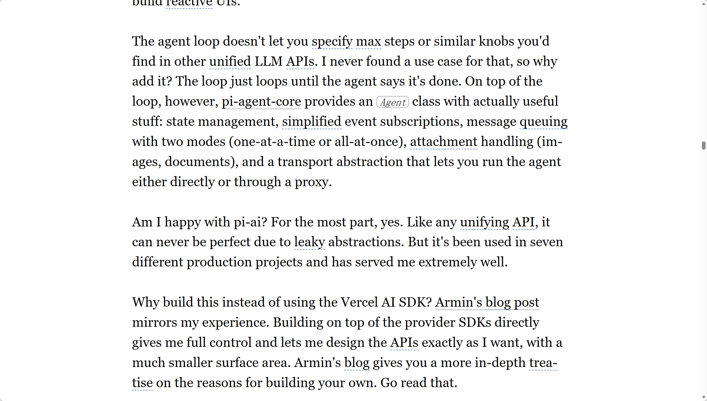
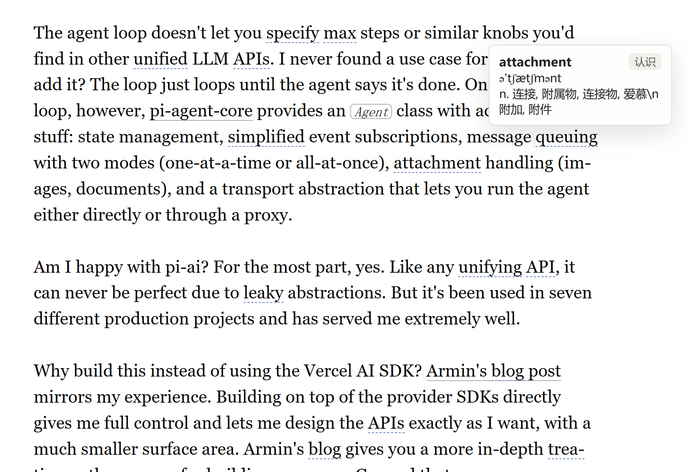
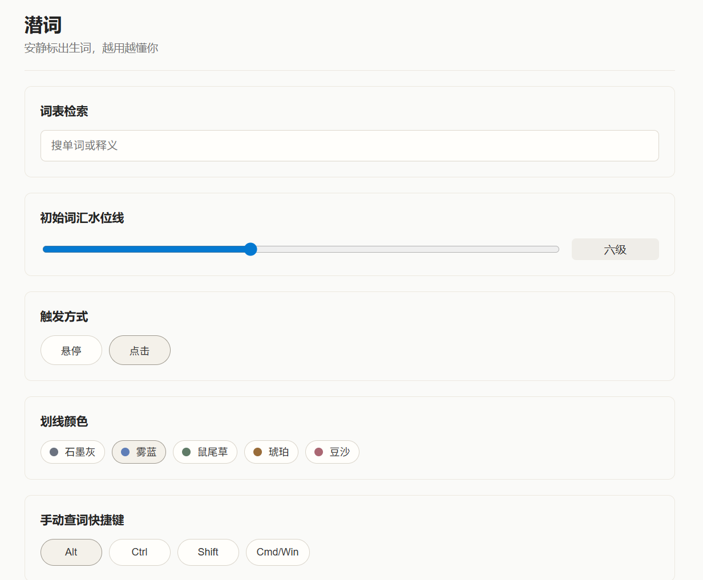
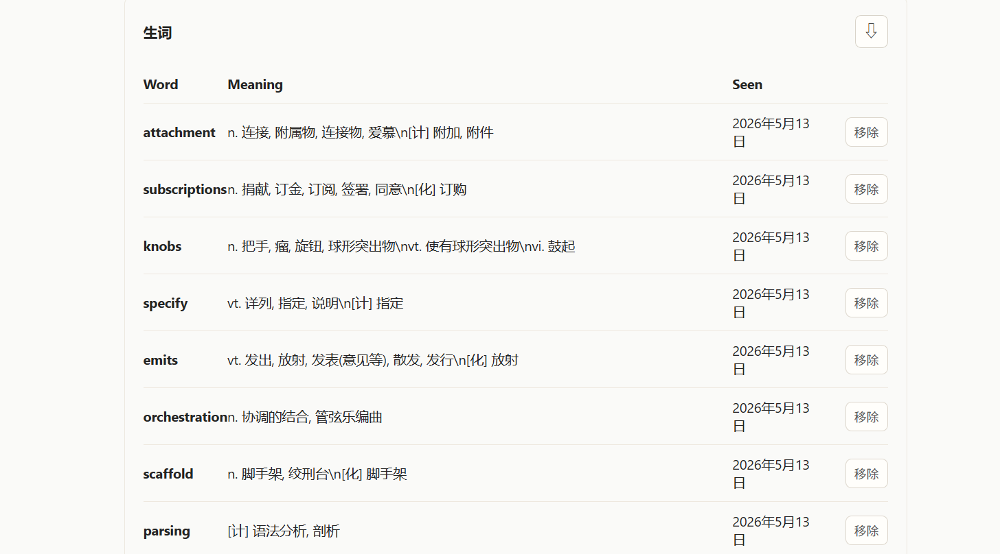

# 潜词 QianCi

> 一个面向中文用户的极简英文网页查词扩展。

[](./LICENSE)
[](https://developer.chrome.com/docs/extensions/)
[](./package.json)

潜词专注做好一件事：

**当你阅读英文网页时，它安静地标出你可能不认识的词，并在你需要时给出简短中文释义。**

它不做整页翻译，不做学习平台，也不试图把网页变成控制台。目标一直很克制：**低打扰、低占用、越用越准。**

## 功能亮点

- 在英文网页正文中预判并标出生词
- 悬停或点击标注词，弹出极简中文释义卡片
- 支持 `Alt + 选词` 手动查词
- 支持右键菜单查词
- 支持一键标记“认识”
- 自动记录生词与熟词
- 支持切换触发方式、划线颜色和手动查词快捷键
- 支持在设置页调节标注密度，少打扰或多提醒都可以自己掌控
- 设置页提供首次使用引导，可跳过，也可之后重新打开
- 支持当前站点自动标注、仅手动查词、暂停潜词三种模式
- 弹窗内可查看当前页面诊断，可一键重新扫描本页，也可复制不含正文的诊断信息
- 支持查看被弱反馈隐藏的词，并对单个词恢复提醒或设为总是提醒
- 本地词库没有某个词时，可手动触发联网补查
- 联网补查遇到临时网络失败、超时、限流时会进入本地重试队列
- 可在扩展弹窗查看联网补查重试摘要，并在设置页查看或清空队列

## 截图

| 阅读页面 | 查词小窗 |
| --- | --- |
|  |  |

| 设置页面 | 生词列表 |
| --- | --- |
|  |  |

## 适合谁

如果你经常在浏览器里读这些内容，潜词会比较合适：

- 英文博客、文档、长文
- 不想被整页翻译打断阅读的人
- 想保留一点学习反馈，但不想打开复杂学习系统的人

## 它现在能做什么

- 预判英文网页正文中的可能生词，并用低干扰虚线标注
- 显示单词原型、音标和简短中文释义
- 点击“认识”后移除标注，并记入熟词
- 对标注但未触发查词的单词记录弱正反馈
- 对弱反馈误判的词，可在设置页单独恢复提醒或设为总是提醒
- 对漏判词支持手动查词
- 设置页提供学习回顾，优先展示最近查过、查得最多和最近认识的词
- 完整生词表支持导出 CSV 和带格式版本的 JSON 备份
- 在浏览器本地保存用户画像、生词、熟词和在线补查缓存
- 对临时失败的联网补查进行本地排队，并通过浏览器 alarm 在合适时机重试
- 在弹窗和设置页展示联网补查重试状态，失败请求不会悄悄消失
- 提供一个尽量克制的设置页
- 提供当前站点快速控制，遇到复杂页面时可降级为仅手动查词或暂停
- 提供当前页面诊断，帮助判断是否已标注、是否仍在扫描，并支持重新扫描和复制诊断

## 如何安装

Chrome / Edge：

### 方式一：直接使用 Release 安装包

1. 在 Releases 页面下载扩展安装包
2. 解压后，进入包含 `manifest.json` 的目录
3. 打开 `chrome://extensions` 或 `edge://extensions`
4. 打开开发者模式
5. 选择“加载已解压的扩展程序”
6. 选择刚才解压出来的目录

### 方式二：本地构建

1. 运行 `npm install`
2. 运行 `npm run build`
3. 打开 `chrome://extensions` 或 `edge://extensions`
4. 打开开发者模式
5. 选择“加载已解压的扩展程序”
6. 选择项目里的 `dist` 目录

### 注意

不要直接加载 GitHub 自动生成的 `Source code (zip)` 或源码仓库根目录。

那个压缩包是项目源码，不是可直接导入浏览器的构建产物；Chrome 需要的是包含 `manifest.json` 的目录。

## 如何使用

- 对已标注单词：
  - 根据设置选择悬停或点击查看释义
  - 也可以用 `Tab` 聚焦标注词，再按 `Enter` 或 `Space` 打开释义；打开后可直接按键操作 `认识` 或 `联网查询`
- 对漏判单词：
  - `Alt + 选中单词`
  - 或使用右键菜单
- 对误判单词：
  - 点击小窗里的 `认识`
- 对想继续看到的词：
  - 点击小窗里的 `继续提醒`，避免它被弱反馈误判为已认识
- 关闭查词小窗：
  - 点击小窗里的关闭按钮，或按 `Escape`
  - 如果小窗由键盘打开，关闭后焦点会回到原来的标注词
- 打开设置页：
  - 点击扩展图标
- 首次使用引导：
  - 设置页会用三步解释英语水平、标注密度和“认识 / 未查看”的影响
  - 可直接选择 `安静阅读` / `平衡默认` / `多提醒学习`，快速应用标注密度和查词触发方式
  - 可点击 `知道了` 跳过，也可之后用 `重新打开引导` 再看
- 当前站点控制：
  - 点击扩展图标后选择 `自动标注` / `仅手动查词` / `暂停潜词`
- 页面诊断：
  - 点击扩展图标查看当前页已标注词数和已检查文本段数
  - 如果已检查文本但没有标注，会说明可能是词汇已认识、低于提醒阈值或标注密度较保守
  - 遇到编辑区、表单页或代码内容较多的页面时，会提示更稳妥的使用方式
  - 对编辑器或代码页，可在诊断面板中一键切到 `仅手动查词`
  - 如页面刚加载完或内容动态变化，可点击 `重新扫描本页`
  - 如需反馈问题，可点击 `复制诊断信息`；复制内容包含域名、扫描统计、警告类型和扩展版本，不包含页面正文
  - 如果当前页面暂不可读，仍可复制最小诊断，帮助判断是权限、站点模式还是页面限制
- 标注策略：
  - 在设置页调整 `标注密度`：往左少打扰，往右多提醒
  - 在设置页查看最近被跳过的词
  - 对单个词选择 `恢复提醒`，清除这一个词的跳过记录
  - 对单个词选择 `总是提醒`，避免它再次被弱反馈隐藏
- 学习回顾：
  - 设置页会优先展示最近查过、查得最多和最近认识的词
  - 对查得最多的生词，可直接点 `标为认识`，不用再去完整词表里找
  - 再进入完整生词和熟词表做移除、导出等操作
  - 生词可导出为 CSV，方便导入表格；也可导出为 JSON，方便备份、迁移或脚本处理
- 联网补查重试队列：
  - 点击扩展图标查看摘要
  - 打开设置页查看待重试状态，必要时清空队列
- 数据与隐私：
  - 设置页会显示生词、熟词、联网缓存、待重试和站点设置数量
  - 可清空联网补查缓存；生词记录和用户自定义词条不会被删除
  - 可清空站点设置，让所有网站恢复默认自动模式；生词和学习设置不会被删除
  - 正常标注和本地查词不会上传整页内容

## 它是怎么工作的

### 本地优先

潜词优先使用本地词典和词频索引进行判断和查词，尽量保证响应快、打扰少。

### 反馈驱动

用户行为会逐步修正预判：

- 手动查词代表系统漏判
- 点击“认识”代表系统误判
- 被标注但持续跳过代表弱正反馈

这些反馈会影响之后的标注倾向，而不只是积累静态词表。

### 联网补查

当本地词典没有某个词时，用户可以手动触发联网查询。成功结果会被统一格式化后写回本地缓存和生词体系。

## 本地开发

```bash
npm install
npm test
npm run build
```

构建产物在 `dist/`。

## 项目结构

```text
src/
  background/    后台 worker 与在线查词桥接
  content/       页面扫描、标注、tooltip、手动查词
  core/          决策逻辑、用户画像、消息、类型定义
  options/       设置页 UI
  storage/       浏览器存储适配与数据读写
  data/          生成后的本地词典与词频索引
scripts/
  build-dictionary.ts
  smoke-extension.ts
tests/
  unit/
docs/
  screenshots/
```

## 词典与数据来源

- 本地词典包基于 ECDICT 源数据构建并精简
- 运行时使用 `src/data/` 下的生成文件
- 联网补查当前使用：
  - [FreeDictionaryAPI](https://freedictionaryapi.com/)
  - [MyMemory Translation API](https://mymemory.translated.net/)

## 隐私说明

潜词尽量把数据留在本地：

- 用户画像、生词、熟词、在线补查缓存都保存在浏览器本地
- 正常标注和本地查词不会上传整页网页内容
- 只有用户主动触发联网查询时，才会向第三方服务发送最小必要文本

更完整的说明见 [PRIVACY.md](./PRIVACY.md)。

## 测试

```bash
npm test
```

当前验证包括：

- 类型检查
- 单元测试
- 构建验证
- 浏览器 smoke test

## License

MIT，见 [LICENSE](./LICENSE)。

欢迎与我交流，也欢迎提交 issue 和 PR。

本项目积极参与并认可 [linux.do社区](linux.do)。
